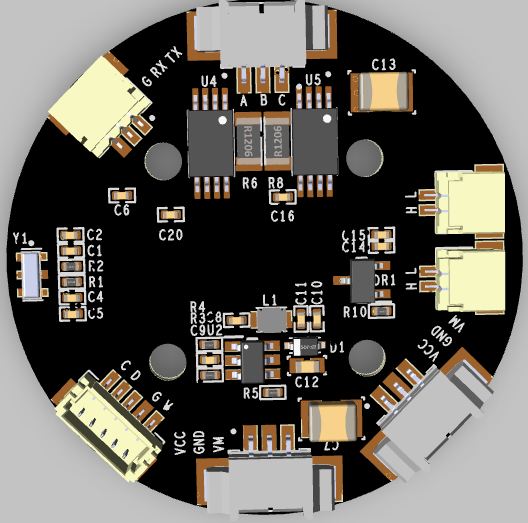
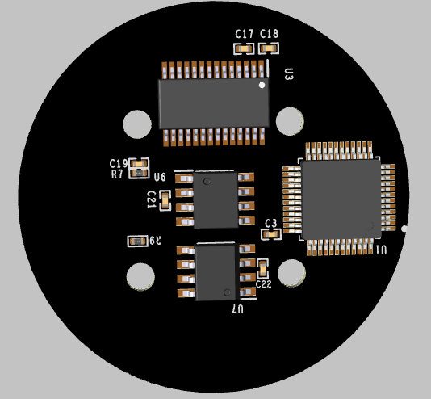

## LiteFoc

### Hardware

design for **2804** DC brushless motor

- top

- bottom

### FrameWare

| name    | type          |
| ------- | ------------- |
| MCU     | STM32F103C8T6 |
| Encoder | MT6816        |
| Current | INA240A2      |
| Driver  | DRV8313       |
| CAN     | SN65HVD232    |

- [x] can && uart commuication

- [x] angle closed loop
- [x] speed closed loop
- [ ] current closed loop

### Thanks

[Arduino-FOC](https://github.com/simplefoc/Arduino-FOC)